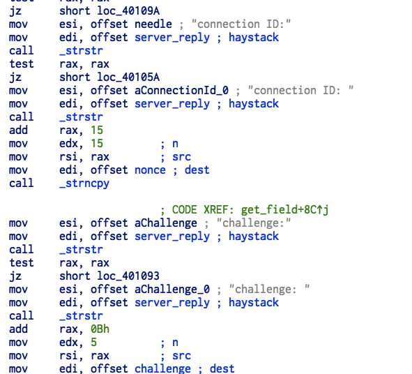
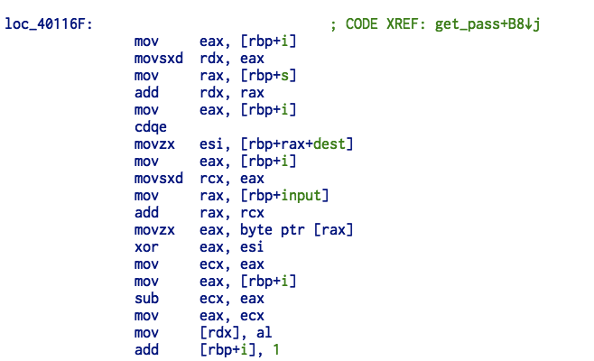

User Auth 250 points
================

题意
-------------

Iromise has wrote a client and a server for authentication, now we have got his demo client.

Cheat this fancy secret server and get the key!

Remote server : ./client host ip 

Attachment: user_auth.zip

解题步骤
-------------

通过逆向的值，大概有这些通信内容：

```
>> connection id: [nonce]
>> what version is your client?
<< version 3.11.54
>> hello...who is this?
<< wdeil
>> enter user password
<< some_printable_chars
>> hello wdeil, what would you like to do?
<< list users
>> ... omitted ...
<< hello wdeil, what would you like to do?
>> print key
```

由于题目中说了作者是 `iromise` ，所以我们需要把 `wdeil` 换成 `iromise` 。但是代码中没有预留足够的空间，所以需要自己编写脚本。几个重要的点：





编写 [auth.py](auth.py) 模拟密码的生成：

```
from pwn import *
r = remote('202.112.51.234', 20000)
r.sendline('version 3.11.54')
cid = r.recvline()
nonce = cid[15:-1]
rand_num = nonce[7]
mutator = 1
ecx = ord(rand_num[0])
# ecx = ecx % 3
user = 'iromise'
#from nonce[var_14] to dest for 5 bytes
var_14 = (ecx % 3)+ mutator
dest = nonce[var_14:var_14+len(user)]
#for each i
s = []
for i in range(0, len(user)):
    esi = ord(dest[i]) # $rbp-0x10
    rax = ord(user[i]) # *(long*)($rbp-0x28)
    s.append((esi^rax)-i) # *(long*)($rbp-0x30)
    # > 0x7E then sub 0x7E
    # < 32 then add 32
    if s[i] > 0x7E:
        s[i] -= 0x7E
    if s[i] < 0x20:
        s[i] += 0x20
    s[i] = chr(s[i])
s = ''.join(s)
r.sendline(user)
r.sendline(s)
r.sendline('list users')
r.sendline('print key')
challenge = r.recvline_startswith('challenge:')[11:]
print repr(challenge)
mutator = 7
var_14 = (ecx % 3)+ mutator
dest = nonce[var_14:var_14+len(challenge)]
#for each i
s = []
for i in range(0, len(challenge)):
    esi = ord(dest[i]) # $rbp-0x10
    rax = ord(challenge[i]) # *(long*)($rbp-0x28)
    s.append((esi^rax)-i) # *(long*)($rbp-0x30)
    # > 0x7E then sub 0x7E
    # < 32 then add 32
    if s[i] > 0x7E:
        s[i] -= 0x7E
    if s[i] < 0x20:
        s[i] += 0x20
    s[i] = chr(s[i])
s = ''.join(s)
print repr(s)
r.sendline(s)
r.interactive()
```

得到 `THUCTF{Y0u_Hav3_ST0LEN_0ur_data_fR0M_1r0m1se}` 。